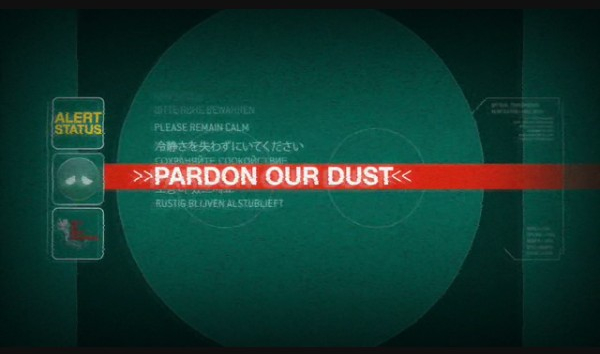

<script>
  function addCss(fileName) {

    var head = document.head;
    var link = document.createElement("link");

    link.type = "text/css";
    link.rel = "stylesheet";
    link.href = fileName;

    head.appendChild(link);
  }

  if (window.location.pathname.match("/MTk3ODkK")) {
    addCss('/css/MTk3ODkK.css');
  }
</script>

# Header 1
## Header 2
### Header 3
#### Header 4
##### Header 5
###### Header 6

This is normal text.

*this is italic text.*

**this is bold text.**

***this is bold italic text.***

`this is typewriter text.`

*`this is italic typewriter text.`*

**`this is bold typewriter text.`**

***`this is bold italic typewriter text.`***

    this is typewriter text
    that preserves whitespace,
    and ignores markdown syntax like *this*.

```ruby
# Number -> Number
def factorial(n)
    "free string"
    if n == 0
        1
    else
        n * factorial(n - 1)
    end
end
```

$$
E = mc^2
$$

Press <kbd>A</kbd> to do something.

Press <kbd>Ctrl+a</kbd> to do something else.

> this is a quote.

[This is a link](#).

---

- Boston
    1. NU
    2. BU
- Denver
    - DU
    - Regis University
- New York
    - Columbia
    - NYU

1. Think of a cool idea.
    * brainstorm
    * drink coffee.
2. Start working.
    1. boot computer.
    2. drink more coffee
3. ???
4. Profit.

- [ ] Milk
- [x] Eggs

First Header | Second Header
------------ | -------------
Content cell 1 | Content cell 2
Content column 1 | Content column 2



<form>
    <label for="textInput">Text:</label>
    <input id="textInput" type="text" />
    <label for="textareaInput">Textarea:</label>
    <textarea id="textareaInput"></textarea>
    <fieldset>
        <legend>Make a choice:</legend>
        <input id="aRadio" type="radio" />
        <label for="aRadio">A</label>
        <br />
        <input id="bRadio" type="radio" />
        <label for="bRadio">B</label>
    </fieldset>
    <label for="langs">Choose a language:</label>
    <select id="langs">
      <option value="ruby">Ruby</option>
      <option value="rust">Rust</option>
      <option value="racket">Racket</option>
      <option value="R">R</option>
    </select> 
    <label for="langs">Enter a browser:</label>
    <input list="browsers" />
    <datalist id="browsers">
        <option value="Internet Explorer" />
        <option value="Firefox" />
        <option value="Chrome" />
        <option value="Opera" />
        <option value="Safari" />
    </datalist>
    <button type="button">Click</button>
    <input type="submit" />
</form>

# Syntax Test

```rust
// All good code starts with a comment, right?
/// This is the start of the glorius documentation.
fn main() {
    println!("Hello.");
}
```
